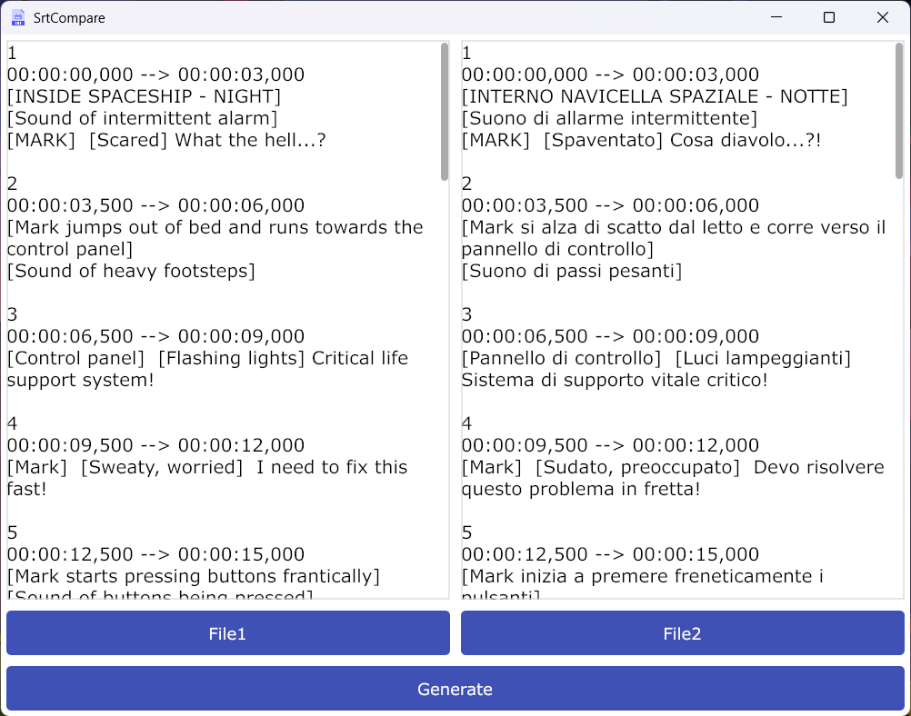
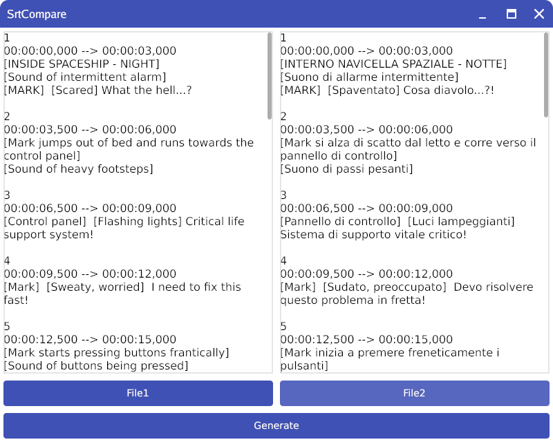

# SrtCompare

SrtCompare is a cross platform desktop application written in Go that helps you compare subtitle files (.srt) in different languages by generating an Excel spreadsheet for easy comparison.

## Features

- Compare two .srt files side by side in an Excel spreadsheet
- Cross Platform
- Simple and intuitive interface
- Generates structured output with subtitle index, timing, and content from both files

## Installation

1. Download the latest release from the [releases](https://github.com/albertovito/SrtCompare/releases)
2. Run the executable - no installation required

## Usage

1. Launch the application
2. Select your first .srt file using the file picker
3. Select your second .srt file using the file picker
4. Click "Generate" to create the Excel file
5. The generated .xlsx file will contain four columns:
   - Index: The subtitle sequence number
   - Timing: The timestamp of the subtitle
   - File1: Content from the first subtitle file
   - File2: Content from the second subtitle file

### Windows

### Linux

## Generated Excel Format

The output Excel file will have the following structure:

| Index | Timing           | File1        | File2        |
|-------|-----------------|--------------|--------------|
| 1     | 00:00:01,000 --> 00:00:04,000 | Subtitle 1 in language A | Subtitle 1 in language B |
| 2     | 00:00:05,000 --> 00:00:08,000 | Subtitle 2 in language A | Subtitle 2 in language B |

## Building from Source

Requirements:
- Go 1.23 or higher

```bash
# Clone the repository
git clone https://github.com/vitoalbe/SrtCompare

# Navigate to the project directory
cd SrtCompare

# Install dependencies
go mod download

# Build the project for linux
GOOS=linux go build -o SrtCompare main.go

# Build the project for windows
GOOS=windows go build -ldflags="-H windowsgui"
```

## Dependencies

- [zenity](https://github.com/ncruces/zenity) - Dialogs for Golang, Windows and macOS
- [gioui](https://gioui.org) - Cross-Platform GUI for Go
- [excelize](https://github.com/qax-os/excelize) - Excel file manipulation

## Contributing

Feel free to open issues or submit pull requests if you have suggestions for improvements or bug fixes.

## License

[MIT License](LICENSE)
